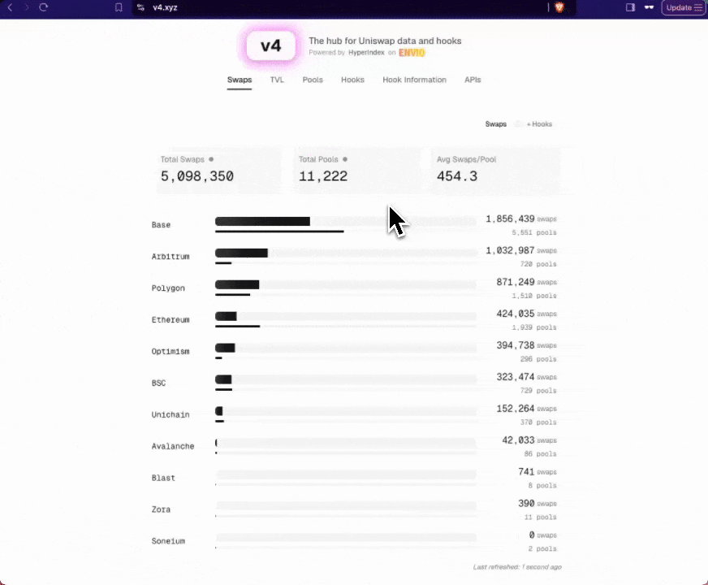

# Uniswap V4 Indexer for EDCON 2025 Workshop

A Uniswap V4 indexer built with [Envio](https://envio.dev) for the EDCON 2025 workshop, specifically configured for tracking hooks and pools on Unichain.

_Please refer to the [documentation website](https://docs.envio.dev) for a thorough guide on all [Envio](https://envio.dev) indexer features_

This indexer is optimized for the workshop environment and focuses on:
- LiquidityPenaltyHook
- AntiSandwichHook  
- LimitOrderHook

**Note:** This indexer is part of the Uniswap V4 workshop materials and provides real-time data to the analytics dashboard.



## Overview

This indexer tracks key metrics and events from Uniswap V4 pools on Unichain:

- **Hook Events**: Initialize, Swap, ModifyLiquidity events from deployed hooks
- **Pool Statistics**: Volume, TVL, fees, and transaction counts
- **Position Management**: Track Position NFT transfers and liquidity changes
- **Real-time Analytics**: Power the workshop dashboard with live data

The indexer is pre-configured for the workshop hooks and provides GraphQL endpoints for querying.

## Getting Started

### Prerequisites

Before running the indexer, ensure you have the following installed:

- Node.js (v18 or newer)
- pnpm (v8 or newer)
- Docker Desktop

### Installation

1. Clone the repository
2. Install dependencies:
   ```
   pnpm i
   ```

### Running the Indexer

Start the indexer with:

```
pnpm envio dev
```

This command will:

- Start all required services using Docker
- Initialize and run the indexer

### Accessing Data

Once the indexer is running, you can view and query all indexed data at:

```
http://localhost:8080
```

This will open the Hasura console where you can explore and query the indexed data using GraphQL.

### Configuration

The indexer is pre-configured for Unichain:

- **Network**: Unichain (Chain ID: 130)
- **RPC**: https://unichain-rpc.publicnode.com
- **Start Block**: 1800000 (optimized for workshop)

No additional RPC configuration is needed for the workshop.

## Workshop Usage

### Example GraphQL Queries

1. **Get Recent Swaps**:
```graphql
query RecentSwaps {
  Swap(order_by: {blockTimestamp: desc}, limit: 10) {
    id
    pool {
      poolId
      hooks
    }
    amount0
    amount1
    sender
    blockTimestamp
  }
}
```

2. **Get Pool Statistics**:
```graphql
query PoolStats {
  Pool {
    poolId
    hooks
    sqrtPrice
    liquidity
    swapCount
    txCount
  }
}
```

3. **Get Hook Information**:
```graphql
query HookInfo {
  Hook {
    hooks
    poolCount
    swapCount
    txCount
  }
}
```

### Monitoring Sync Status

The indexer will show sync progress in the console. Initial sync may take 10-30 minutes depending on chain activity.

## Troubleshooting

### Common Issues

1. **Docker not running**:
   - Make sure Docker Desktop is started
   - Check `docker ps` to verify Docker is responsive

2. **Port conflicts**:
   - Ensure port 8080 is not in use by other services
   - The indexer uses ports 5432 (PostgreSQL) and 8080 (Hasura)

3. **Slow initial sync**:
   - Initial synchronization can take time
   - Monitor progress via console logs
   - The indexer catches up from block 1800000

### Workshop Support

For workshop-specific questions:
- Check the main workshop documentation in `/docs`
- Refer to the CLAUDE.md file for detailed instructions
- Contact workshop organizers for assistance
