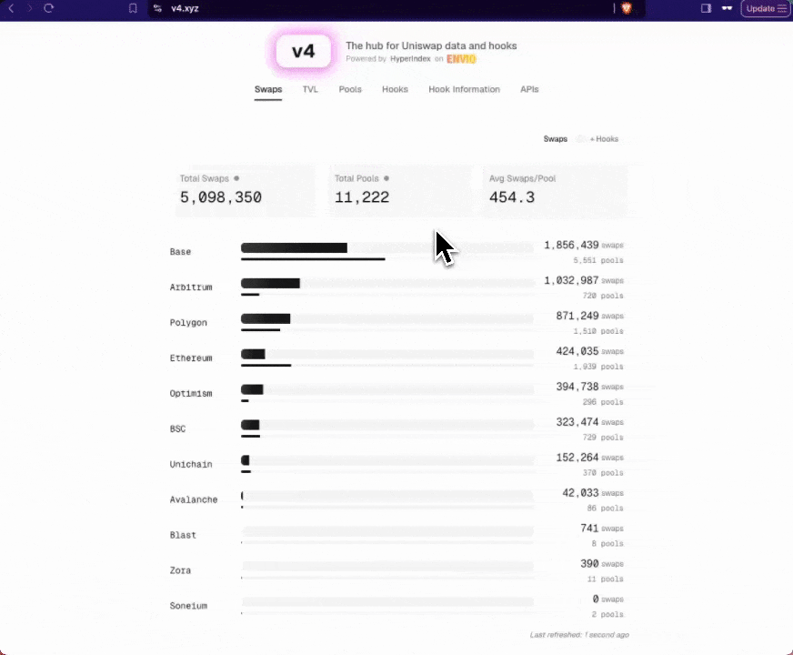

# EDCON 2025 ワークショップ用 Uniswap V4 インデクサー

Unichain上のフックとプールを追跡するために特別に設定された、EDCON 2025ワークショップ用の[Envio](https://envio.dev)で構築されたUniswap V4インデクサーです。

_すべての[Envio](https://envio.dev)インデクサー機能の詳細なガイドについては、[ドキュメントウェブサイト](https://docs.envio.dev)をご参照ください_

このインデクサーはワークショップ環境に最適化されており、以下に焦点を当てています：
- LiquidityPenaltyHook
- AntiSandwichHook  
- LimitOrderHook

**注意：** このインデクサーはUniswap V4ワークショップ資料の一部であり、分析ダッシュボードにリアルタイムデータを提供します。



## 概要

このインデクサーは、Unichain上のUniswap V4プールからの主要な指標とイベントを追跡します：

- **フックイベント**：デプロイされたフックからの初期化、スワップ、流動性変更イベント
- **プール統計**：取引量、TVL、手数料、トランザクション数
- **ポジション管理**：Position NFTの転送と流動性変更の追跡
- **リアルタイム分析**：ライブデータでワークショップダッシュボードを支援

インデクサーはワークショップフック用に事前設定されており、クエリ用のGraphQLエンドポイントを提供します。

## はじめに

### 前提条件

インデクサーを実行する前に、以下がインストールされていることを確認してください：

- Node.js（v18以降）
- pnpm（v8以降）
- Docker Desktop

### インストール

1. リポジトリをクローンします
2. 依存関係をインストールします：
   ```
   pnpm i
   ```

### インデクサーの実行

以下のコマンドでインデクサーを開始します：

```
pnpm envio dev
```

このコマンドは以下を実行します：

- Dockerを使用して必要なサービスをすべて開始
- インデクサーを初期化して実行

### データへのアクセス

インデクサーが実行されると、以下のURLですべてのインデックス化されたデータを表示・クエリできます：

```
http://localhost:8080
```

これによりHasuraコンソールが開き、GraphQLを使用してインデックス化されたデータを探索・クエリできます。

### 設定

インデクサーはUnichain用に事前設定されています：

- **ネットワーク**：Unichain（チェーンID：130）
- **RPC**：https://unichain-rpc.publicnode.com
- **開始ブロック**：1800000（ワークショップ用に最適化）

ワークショップでは追加のRPC設定は必要ありません。

## ワークショップでの使用方法

### GraphQLクエリの例

1. **最近のスワップを取得**：
```graphql
query RecentSwaps {
  Swap(order_by: {blockTimestamp: desc}, limit: 10) {
    id
    pool {
      poolId
      hooks
    }
    amount0
    amount1
    sender
    blockTimestamp
  }
}
```

2. **プール統計を取得**：
```graphql
query PoolStats {
  Pool {
    poolId
    hooks
    sqrtPrice
    liquidity
    swapCount
    txCount
  }
}
```

3. **フック情報を取得**：
```graphql
query HookInfo {
  Hook {
    hooks
    poolCount
    swapCount
    txCount
  }
}
```

### 同期状況の監視

インデクサーはコンソールに同期の進行状況を表示します。初回同期はチェーンのアクティビティによって10〜30分かかる場合があります。

## トラブルシューティング

### よくある問題

1. **Dockerが実行されていない**：
   - Docker Desktopが開始されていることを確認してください
   - `docker ps`を確認してDockerが応答していることを確認してください

2. **ポートの競合**：
   - ポート8080が他のサービスで使用されていないことを確認してください
   - インデクサーはポート5432（PostgreSQL）と8080（Hasura）を使用します

3. **初回同期が遅い**：
   - 初回の同期には時間がかかる場合があります
   - コンソールログで進行状況を監視してください
   - インデクサーはブロック1800000から追いつきます

### ワークショップサポート

ワークショップ固有の質問については：
- `/docs`のメインワークショップドキュメントを確認してください
- 詳細な手順については、CLAUDE.mdファイルをご参照ください
- サポートが必要な場合はワークショップ主催者にお問い合わせください