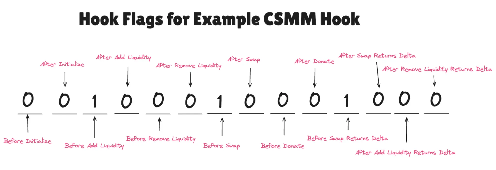
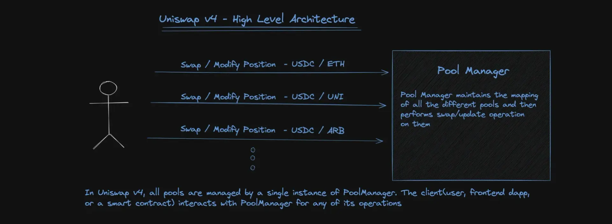
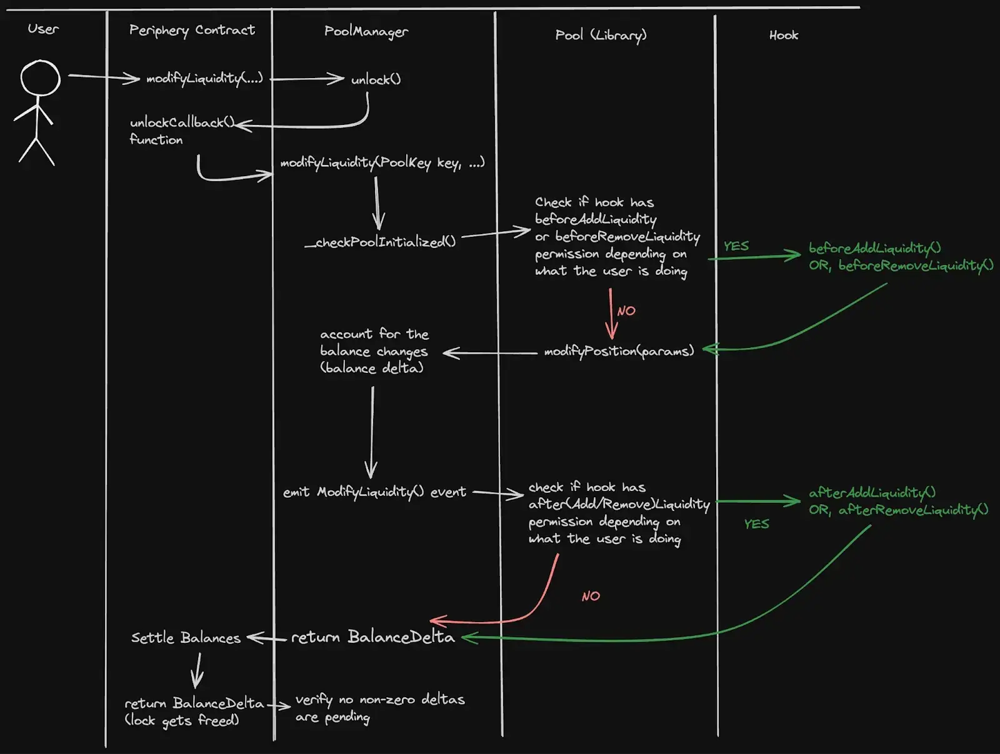
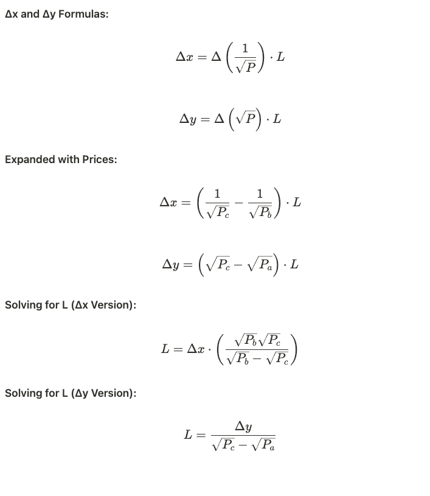
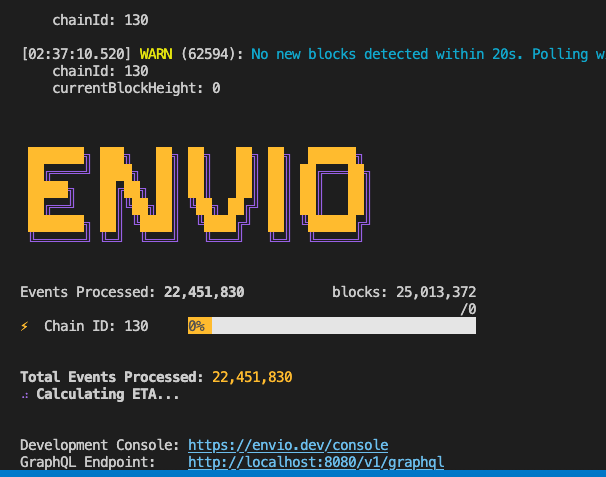

# 🎯 Uniswap V4 ワークショップ 50分間完全スクリプト

## 📋 ワークショップ概要

- **所要時間**: 50分
- **目的**: Uniswap V4 Hooksの開発、デプロイ、テスト、分析の全フローを体験
- **重点**: セキュリティを中心とした実装パターンの理解

### 📦 必要なツール

- **Foundry**: スマートコントラクトのコンパイルとデプロイ用
- **TypeScript/Node.js**: SDKスクリプト実行用
- **Docker Desktop**: インデクサー（PostgreSQL + Hasura）の実行用 ⚠️ **必須実行**
- **Bun**: パッケージマネージャー（推奨）
- **pnpm**: インデクサーとダッシュボード用パッケージマネージャー（⚠️ apps/ディレクトリ用）

---

## ⏱️ タイムテーブル

| 時間      | セクション           | 内容                                                         |
| --------- | -------------------- | ------------------------------------------------------------ |
| 0-5分     | 環境セットアップ     | リポジトリクローン、依存関係インストール、環境変数設定       |
| 5-17分    | Hookデプロイ         | HookMinerでのデプロイ、Foundryテスト、パーミッションビット理解 |
| 17-25分   | プール作成           | デプロイしたHookでプール作成、設定確認                       |
| 25-35分   | SDK操作              | 流動性追加/削除、スワップ実行、Hook動作確認                  |
| 35-42分   | インデクサー/UI起動  | Envioインデクサーとダッシュボードでの可視化                  |
| 42-50分   | セキュリティレビュー | 重要なセキュリティパターン、まとめ                           |

---

## 🎬 セクション1: 環境セットアップ（0-5分）

### 1.1 導入（1分）

> 皆さん、こんにちは。今日はUniswap V4 Hooksのワークショップを行います。
> 50分間で、V4の革新的なHooks機能のデプロイからテストまでを体験していただきます。
> 特に、セキュリティファーストな実装パターンに重点を置いて進めます。

### 1.2 リポジトリセットアップ（2分）

```bash
# まず、ワークショップリポジトリをクローンします
git clone https://github.com/ZaK3939/v4-workshop
cd v4-workshop

# Bunを使って依存関係をインストール
# 注意: npm や yarn は使用しないでください（インデクサー以外）
bun install
```

> Bunが依存関係をインストールしている間に、
> V4 Hooksの特徴について簡単に説明いたします。

### 1.3 環境変数設定（2分）

```bash
# contractsディレクトリに移動
cd contracts

# 環境変数ファイルをコピー
cp .env.example .env
```

> .envファイルを開いて、以下の項目を設定してください：

```env
# Unichain メインネット RPC エンドポイント
UNICHAIN_RPC=https://unichain-rpc.publicnode.com

# あなたの秘密鍵（0xプレフィックスなし）
# ⚠️ Gitには絶対にコミットしないでください！
PK=your_private_key_here

# Etherscan API キー（オプション）
ETHERSCAN_API_KEY=your_etherscan_api_key
```

> 秘密鍵を設定したら、残高を確認しましょう：

```bash
# 環境変数を読み込み
source .env

# デプロイヤーアドレスを設定（重要！）
export ETH_FROM=$(cast wallet address --private-key $PK)
echo "デプロイヤーアドレス: $ETH_FROM"

# 残高確認
cast balance $ETH_FROM --rpc-url $UNICHAIN_RPC | cast from-wei
```

> 少なくとも0.0005 ETH以上の残高があることを確認してください。

---

## 🎬 セクション2: Hookデプロイ（5-17分）

### 2.1 V4 Hooksの独自性理解（3分）

> V4 Hooksの最も革新的な点は、**パーミッション情報がコントラクトアドレス自体にエンコードされている**ことです。
> CSMM（定数和マーケットメーカーカスタムカーブフック）コントラクトを例にしてみましょう。Hookアドレスの末尾2バイト、4888を見て、これを16ビットに変換すると、01_00100010001000になります。

```
例: 0x1EC90889C6633A0d01932fbf83be93c22d194888

Hookアドレスをデコードし、末尾2バイトを抽出してバイナリに変換し、
ビット演算ANDを適用してHookフラグを見つけます：
```



> 上図は、CSMM（定数和マーケットメーカー）Hookのパーミッションビットを示しています。
> 各ビットは特定のコールバック関数に対応し、1に設定されたビットのみが実行可能です。
>
> これは何を意味するのでしょうか？
>
> 1. **決定論的アドレス**: HookMinerが特定のパーミッション用のアドレスを計算
> 2. **ガス効率性**: PoolManagerが高速なビット演算でパーミッションチェック
> 3. **セキュリティ**: パーミッションは不変で、実行時に改ざんできない

### 2.2 LiquidityPenaltyHookのデプロイ（5分）

> それでは、LiquidityPenaltyHookをデプロイしましょう。
> このHookは、JIT攻撃を防ぐ目的で設計されています。

#### JIT攻撃とは？

> **JIT（Just-In-Time）攻撃**は、MEVボットが使用する搾取戦略です：


> 上図のように、JIT攻撃は3ステップで実行されます：
>
> 1. **大きなスワップを検知** → MEVボットがメンプールで大きなトランザクションを発見
> 2. **直前に流動性追加** → スワップ直前に大量の流動性を提供
> 3. **手数料を獲得** → 大きなスワップから多額の手数料を獲得
> 4. **即座に流動性削除** → スワップ完了直後に流動性を引き出し
>
> これにより、長期的なリスクを負うことなく手数料を獲得できます。
> 今日のJITアクティビティをチェック: https://dexanalytics.org/schemas/jit-liquidity-events

#### LiquidityPenaltyHook防御メカニズム

> このHookは以下のメカニズムでJIT攻撃を防止します：
>
> **ペナルティ計算式**:
>
> ```
> penalty = fees × (blockNumberOffset - elapsedBlocks) / blockNumberOffset
> ```
>
> - **10ブロック以内での削除**: 最大100%のペナルティ
> - **線形減衰**: 時間経過とともにペナルティが減少
> - **ペナルティ配布**: 没収された手数料は既存LPに寄付
>
> これにより短期的な利益追求を阻止し、長期LPを保護します。

```bash
# 環境変数を再確認（重要！）
source .env
export ETH_FROM=$(cast wallet address --private-key $PK)
echo "deployer: $ETH_FROM"

# Hookをデプロイ
forge script script/01_DeployAndSave.s.sol \
    --rpc-url $UNICHAIN_RPC \
    --private-key $PK \
    --broadcast \
    --legacy \
    --ffi \
    -vvv
```

> スクリプト実行中に、何が行われているかを説明します：
>
> 1. **HookMinerがパーミッションビットを計算**
>
>    - afterAddLiquidity: ✅
>    - afterRemoveLiquidity: ✅
>    - afterAddLiquidityReturnDelta: ✅
>    - afterRemoveLiquidityReturnDelta: ✅
>
> 2. **CREATE2でデプロイ**
>    - 計算されたアドレスに正確にデプロイ
>    - ソルトを使用して決定論的に生成

### 2.3 デプロイ結果確認（2分）

```bash
# デプロイされたアドレスを確認
cat script/.deployment.env

# コントラクトコードを確認
cast code $(cat script/.deployment.env | grep LIQUIDITY_PENALTY_HOOK | cut -d'=' -f2) --rpc-url $UNICHAIN_RPC | wc -c
```

> コードサイズが0より大きければ、デプロイ成功です！

### 2.4 Foundryテスト実行（2分）

> デプロイ前に、Hookの動作をテストで確認しましょう：

```bash
# Unichainフォークでテスト実行
cd contracts
forge test --fork-url $UNICHAIN_RPC -vvv
```

> **Foundryテストの特徴**：
>
> - **Unichainフォーク**: 本番環境の状態を完璧に再現
> - **実際のPoolManager**: デプロイされたV4コントラクトを使用
> - **Hook動作検証**: ペナルティ計算と手数料配分の正確性
> - **ガス消費測定**: 実際のガスコストを事前チェック
>
> これにより、本番デプロイ前に完全な検証が可能です。

---

## 🎬 セクション3: プール作成（17-25分）

### 3.1 プール作成の準備（2分）

> 次に、デプロイしたHookを使ってプールを作成します。
> V4では、すべてのプールが単一のPoolManagerで管理されます。



> 上図のように、V4では：
>
> - すべてのプールを単一のPoolManagerで管理
> - ユーザーはフロントエンドやスマートコントラクトを通じて操作
> - すべてのスワップ・流動性操作はPoolManagerを経由

### 3.2 プール作成スクリプト実行（5分）

```bash
# ETH/USDCプール（0.3%手数料）を作成
forge script script/02_CreatePool.s.sol \
    --rpc-url $UNICHAIN_RPC \
    --private-key $PK \
    --broadcast \
    --legacy \
    -vvv
```

> プールが作成されている間に、V4のプール構造について説明します：

#### V3プールを使った初期価格設定

> V4プールの初期化は、**既存のV3プールから現在価格を取得**します：
>
> ```solidity
> // V3 ETH/USDC 0.3%プールから価格を取得
> (uint160 sqrtPriceX96,,,,,,) = IUniswapV3Pool(v3Pool).slot0();
> ```
>
> **なぜV3プールを参照するのか？**
>
> - **価格の整合性**: V3には豊富な流動性があり、正確な市場価格を反映
> - **アービトラージ機会の削減**: V3/V4間の価格差を最小化
> - **スムーズな移行**: 既存のV3ユーザーがV4をシームレスに利用可能
>
> これにより、V4プールは最初から適正な市場価格でスタートできます。

> **PoolKey構造**：
>
> - `currency0`: ETH（アドレス0）
> - `currency1`: USDC
> - `fee`: 3000（0.3%）
> - `tickSpacing`: 60
> - `hooks`: デプロイしたHookアドレス

### 3.3 プール情報表示（3分）

```bash
# プール情報を確認
forge script script/03_ShowPoolInfo.s.sol \
    --rpc-url $UNICHAIN_RPC \
    -vvv
```

> 表示される情報を確認してください：
>
> 1. **Hookパーミッション**: 有効化されたパーミッションのリスト
> 2. **プールID**: PoolKeyのkeccak256ハッシュから生成
> 3. **現在価格**: 初期価格（まだ流動性なし）

---

## 🎬 セクション4: SDK操作（25-35分）

### 4.1 プール状態確認（2分）

```bash
# プロジェクトルートに戻る
cd ..

# 現在のプール状態を確認
bun run scripts/check-pool-state.ts
```

> 流動性がまだ0であることを確認してください。

### 4.2 流動性追加（3分）

> V4では、流動性はPosition NFTとして管理されます。

#### 流動性追加フロー



> 上図は流動性追加時の詳細フローを示しています：
>
> 1. ユーザーがPeriphery Contract経由でmodifyLiquidityを呼び出し
> 2. PoolManagerがunlockを実行し、コールバック関数を呼び出し
> 3. Hookパーミッションをチェックし、該当するbefore/after hookを実行
> 4. BalanceDeltaを計算し、トークンのセトルメントを実行

#### 流動性量の計算

> 流動性追加時の必要量は以下の公式で決まります：
>
> 
>
> **例（ETH/USDC、1 ETH = 3990 USDC）**：
>
> - **現在価格**: √3990 ≈ 63.17（sqrtPriceX96形式）
> - **レンジ**: 3000-5000 USDC/ETH
> - **0.1 ETH追加時**: 約399 USDCが必要
>
> この計算により、両通貨の比率が自動的に決定されます。

```bash
# ETHとUSDCを追加
bun run scripts/04-add-liquidity.ts
```

> スクリプト実行中に、以下の点に注目してください：

#### 重要なコード部分：

```typescript
// V4 SDKを使ってポジション作成
const position = Position.fromAmount0({
  pool,
  tickLower,
  tickUpper,
  amount0: desiredEthAmount.toString(),
  useFullPrecision: true,
});

// MintOptions設定
const mintOptions: MintOptions = {
  recipient: account.address,
  slippageTolerance: new Percent(50, 10_000), // 0.5%
  deadline: deadline.toString(),
  useNative: ETH, // ETHをネイティブトークンとして使用
  hookData: '0x',
};

// V4PositionManagerでポジション作成
const v4PositionManager = new V4PositionManager();
const actions = v4PositionManager.addLiquidity(position, mintOptions);
```

> 1. **Position.fromAmount0**: ETH量から必要なUSDCを自動計算
> 2. **useNative**: WETHにラップせずETHを直接使用
> 3. **V4PositionManager**: V4専用のポジション管理
> 4. **Permit2**: USDCのガスレス承認

### 4.3 即座の流動性削除（ペナルティテスト）（3分）

> LiquidityPenaltyHookの動作を確認しましょう：

```bash
# 流動性を即座に削除
bun run scripts/06-remove-liquidity.ts
```

#### 重要なコード部分：

```typescript
// 削除する流動性を計算（50%削除）
const percentageToRemove = 0.5;
const liquidityToRemove = (currentLiquidity * BigInt(50)) / BigInt(100);

// BurnOptions設定
const burnOptions: BurnOptions = {
  tokenId: BigInt(tokenId),
  liquidityPercentage: new Percent(50, 100),
  slippageTolerance: new Percent(10, 10_000), // 0.1%
  deadline: deadline.toString(),
  collectOptions: {
    expectedCurrencyOwed0: CurrencyAmount.fromRawAmount(ETH, 0),
    expectedCurrencyOwed1: CurrencyAmount.fromRawAmount(USDC, 0),
    recipient: account.address,
  },
};

// V4PositionManagerで流動性削除
const v4PositionManager = new V4PositionManager();
const { actions } = v4PositionManager.removeLiquidity(position, burnOptions);
```

> ⚠️ **ペナルティが適用されます！**
>
> - 追加から2ブロックしか経過していない
> - ペナルティ率: 80%
> - 手数料の80%がプールに寄付される
>
> 1. **liquidityPercentage**: 削除する流動性の割合
> 2. **collectOptions**: 手数料回収の設定
> 3. **LiquidityPenaltyHook**: 手数料の一部を没収

### 4.4 スワップ実行（2分）

```bash
# 0.01 ETHをUSDCにスワップ
bun run scripts/05-swap-universal-router.ts
```

> Universal Router経由での実行に注目してください。

#### 重要なコード部分：

```typescript
// V4Plannerでスワップアクションを構築
const v4Planner = new V4Planner();
const routePlanner = new RoutePlanner();

// スワップパラメータ
const swapParams = {
  poolKey: swapConfig.poolKey,
  zeroForOne: true, // ETH → USDC
  amountIn: swapAmount.toString(),
  amountOutMinimum: minAmountOut.toString(),
  hookData: '0x' as `0x${string}`,
};

// V4アクションを追加
v4Planner.addAction(Actions.SWAP_EXACT_IN_SINGLE, [swapParams]);
v4Planner.addAction(Actions.SETTLE_ALL, [ETH, MAX_UINT128]);
v4Planner.addAction(Actions.TAKE_ALL, [USDC, 0n]);

// Universal RouterにV4コマンドを追加
routePlanner.addCommand(CommandType.V4_SWAP, [v4Planner.actions.toString()]);
```

> 1. **V4Planner**: V4専用のアクション構築
> 2. **SETTLE_ALL**: ETHをPoolManagerに送金
> 3. **TAKE_ALL**: USDCを受け取り
> 4. **Universal Router**: V4_SWAPコマンドで実行

#### スワップ実行フロー


> 上図はスワップ実行時の詳細フローを示しています：
>
> 1. ユーザーがPeriphery Contract経由でスワップを呼び出し
> 2. PoolManagerがbeforeSwapパーミッションをチェック
> 3. スワップを実行し、BalanceDeltaを計算
> 4. afterSwapパーミッションをチェックし、必要に応じて実行
> 5. 最終的なトークンのセトルメント（transfer/ERC-6909）

#### Universal Routerとは？

> **Universal Router**はUniswapの統一ルーティングコントラクトです：
>
> - **マルチプロトコル対応**: V2、V3、V4を単一のエントリーポイントで処理
> - **バッチ実行**: 複数の操作を一つのトランザクションで実行
> - **Permit2統合**: ガスレストークン承認をサポート
> - **最適ルート選択**: 複数プールから最適価格を自動選択
>
> V4では、すべてのスワップがUniversal Router経由で実行され、
> PoolManagerを直接呼び出すことはありません。

---

## 🎬 セクション5: インデクサー/UI起動（35-42分）

### 5.1 Envioインデクサーの紹介とDocker確認（3分）

#### Envio HyperIndexとは？


> **Envio HyperIndex**は高速ブロックチェーンデータインデックスソリューションです：
>
> - **リアルタイムイベント追跡**: 最小限のレイテンシーでイベントストリーミング
> - **超高速バックフィル**: 競合他社の100倍高速（Subsquidより15倍、theGraphより143倍高速）
> - **マルチチェーン対応**: 単一APIで複数チェーンをクエリ
> - **自動リオーグ処理**: ダウンタイムゼロのリオーグ処理
>
> このワークショップでは、すべてのV4プールアクティビティを追跡・分析します。

> ⚠️ **重要: Docker Desktopが実行されている必要があります**
>
> インデクサーはDockerコンテナ内でPostgreSQLとHasuraを実行するため、
> 事前にDocker Desktopを起動しておいてください。

```bash
# Docker Desktopが実行されていることを確認
docker ps

# 成功すると以下のようなコンテナリスト出力が表示されます：
# CONTAINER ID   IMAGE     COMMAND   CREATED   STATUS    PORTS     NAMES

# エラーが発生した場合は、Docker Desktopを起動してください

# インデクサーを起動（PostgreSQL + Hasura自動起動）
bun run indexer
```



> 上図のように、インデクサーが起動すると：
>
> - **大きなENVIOロゴ**が表示され、インデックス処理が開始
> - **処理イベント数**: 22,451,830イベントを高速処理
> - **処理ブロック数**: 25,013,372ブロック（90%進行）
> - **リアルタイム進行**: パーセンテージバーで同期状況表示
>
> インデクサーは以下のイベントを追跡します：
>
> - **Initialize**: プール作成イベント
> - **Swap**: すべてのトランザクション情報（金額、送信者、ブロック番号）
> - **ModifyLiquidity**: 流動性の追加・削除
> - **Transfer/Approval**: Position NFTの移動

### 5.2 GraphQLでのデータ確認（2分）

> EnvioはGraphQLエンドポイントを提供し、複雑なクエリを簡単に実行できます：

```bash
# 最新のスワップを検索
curl -s http://localhost:8080/v1/graphql \
  -X POST \
  -H "Content-Type: application/json" \
  -d '{
    "query": "{ Swap(order_by: {blockNumber: desc}, limit: 5) { id amount0 amount1 sender blockNumber } }"
  }' | jq
```

> ブラウザでhttp://localhost:8080/consoleにアクセスすると、
> Hasura GraphQL Explorerで視覚的にクエリを作成できます。

### 5.3 ダッシュボードUI起動（2分）

> V4のアクティビティを視覚的に確認するため、ダッシュボードを起動しましょう：

> ⚠️ **注意: ダッシュボードはインデクサーのデータを使用します**
>
> 実行前に、インデクサー（Dockerコンテナ）が正常に動作していることを確認してください。

```bash
# プロジェクトルートから実行
bun run dashboard
```

> ダッシュボードが起動したら、ブラウザでhttp://localhost:3000にアクセスしてください。


> **ダッシュボードで確認できること**：
>
> - **Hooked Pulse**: Hooksを持つプールのリアルタイムアクティビティ
> - **Hook Swaps**: 最新のスワップトランザクション（時間、ペア、金額）
> - **Hook Liquidity**: 流動性追加・削除イベント
> - **Dynamic Hooks**: 動的手数料などの高度なHookアクティビティ
> - **自動更新**: 毎秒最新データを表示
>
> 上図のように、各Hookアドレスごとのアクティビティを一目で確認でき、
> デプロイしたLiquidityPenaltyHookの動作をリアルタイムで監視できます。

---

## 🎬 セクション6: セキュリティレビューとまとめ（42-50分）

### 6.1 重要なセキュリティパターン（5分）

> V4 Hooksで最も重要な3つのセキュリティパターンをご紹介します：

#### 1. **onlyPoolManager修飾子**（最重要）

```solidity
modifier onlyPoolManager() {
    if (msg.sender != address(poolManager)) {
        revert OnlyPoolManager();
    }
    _;
}
```

> すべてのHookコールバックに必須です。
> これがないと、誰でもHookを呼び出せてしまいます。

#### 2. **プール間の状態分離**

```solidity
mapping(PoolId => mapping(address => uint256)) private _lastAddedLiquidityBlock;
```

> 複数プールで使用される際の状態混在を防止します。

#### 3. **ゼロチェック**

```solidity
if (liquidity == 0) revert NoLiquidityToReceiveDonation();
```

> ゼロ除算エラーやDoS攻撃を防止します。

### 6.2 LiquidityPenaltyHookの仕組み（3分）

> JIT攻撃防止メカニズムを詳しく見てみましょう：

```solidity
// ペナルティ計算式
penalty = fees * (1 - elapsedBlocks / blockNumberOffset)
```

> - 線形減衰: 10ブロック間で100%→0%
> - ペナルティはプール内LPに寄付
> - 長期LPを保護し、短期利益追求を阻止

### 6.3 ワークショップまとめ（2分）

> 今日学んだこと：


> 上図はV4の全体像を示しています：
>
> - 中央のPoolManagerが複数のプールを管理
> - 各プールに異なるHooks（緑、ピンク、黄色）
> - AngstromやPredicateなどの外部プロトコルも統合可能
>
> ✅ **HookMinerによる特殊なデプロイ**
>
> - パーミッションがアドレスにエンコードされる仕組み
> - CREATE2による決定論的デプロイ
>
> ✅ **セキュリティパターン**
>
> - onlyPoolManager修飾子の重要性
> - プール間の状態分離
> - 適切なエラーハンドリング
>
> ✅ **V4 SDKの活用**
>
> - Permit2によるガスレス承認
> - V4Plannerによるバッチ実行
> - Position NFTによる流動性管理
>
> ✅ **実践的な開発フロー**
>
> - Foundryでのスマートコントラクト開発
> - TypeScript SDKとの統合
> - Envioインデクサーでの分析

---

## 💡 追加リソース

### ドキュメンテーション

- [Uniswap V4 ドキュメンテーション](https://docs.uniswap.org/contracts/v4/overview)
- [OpenZeppelin Hooksオーディットレポート](https://blog.openzeppelin.com/openzeppelin-uniswap-hooks-v1.1.0-rc-1-audit)

### コミュニティ

- [日本語コミュニティ](https://t.me/uniswapjp)
- [Uniswap V4 道場](https://t.me/c/1793969856/1)

### グラント

- Unichain Hook Grant（UF & Atriumがホスト）
- 革新的なHook実装への資金提供

---

## Q&A（残り時間）

> ご質問はありますか？
> Hookのアイデアやセキュリティに関する質問を歓迎します。

### よくある質問：

**Q: なぜHookMinerが必要なのですか？**

> A: V4ではパーミッションがアドレスにエンコードされているため、特定のビットパターンを持つアドレスを見つける必要があります。

**Q: 複数のHooksを組み合わせることはできますか？**

> A: いいえ、プールごとに1つのHookのみです。ただし、Hookが他のコントラクトを呼び出すことは可能です。

**Q: ガスコストはどうですか？**

> A: Hookの複雑さに依存しますが、シンプルなHooksは通常のトランザクションに5-20%のオーバーヘッドを追加します。

---

## 🧹 クリーンアップ（ワークショップ後）

### ワークショップ後のクリーンアップ

> ワークショップお疲れさまでした！環境をクリーンアップしましょう。

#### 1. 流動性の削除

```bash
# 提供した流動性を削除
bun run scripts/06-remove-liquidity.ts
```

#### 2. Dockerコンテナの停止

```bash
# インデクサーをCtrl+Cで停止した後、Dockerコンテナを停止
docker stop $(docker ps -q)

# Docker Desktopを終了
# macOS: メニューバーからDocker Desktopを終了
# Windows: システムトレイからDocker Desktopを終了
```

#### 3. プロセスの停止

```bash
# ダッシュボードなどの実行中プロセスを停止
# Ctrl+Cで停止、または別ターミナルから：
lsof -i :3000  # ダッシュボードのPIDを確認
kill -9 <PID>
```

> ⚠️ **注意**: メインネット（Unichain Mainnet）を使用しているため、デプロイされたコントラクトはチェーン上に永続的に残ります。

---

## 🎉 ワークショップ完了

> 皆さん、お疲れさまでした！
> Uniswap V4 Hooksの世界へようこそ。
> 今日学んだことを活かして、革新的なDeFiプロトコルを構築してください！

### 次のステップ：

1. 他のHook実装を試してみる（AntiSandwichHook、LimitOrderHook）
2. 独自のHookアイデアを実装する
3. Unichain Hook Grantに応募する

**Uniswap V4でDeFiの未来を構築しましょう！ 🚀**