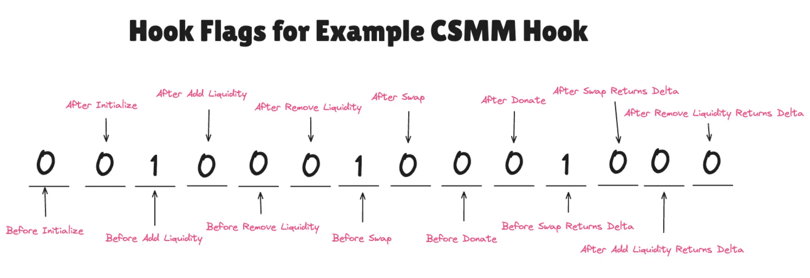
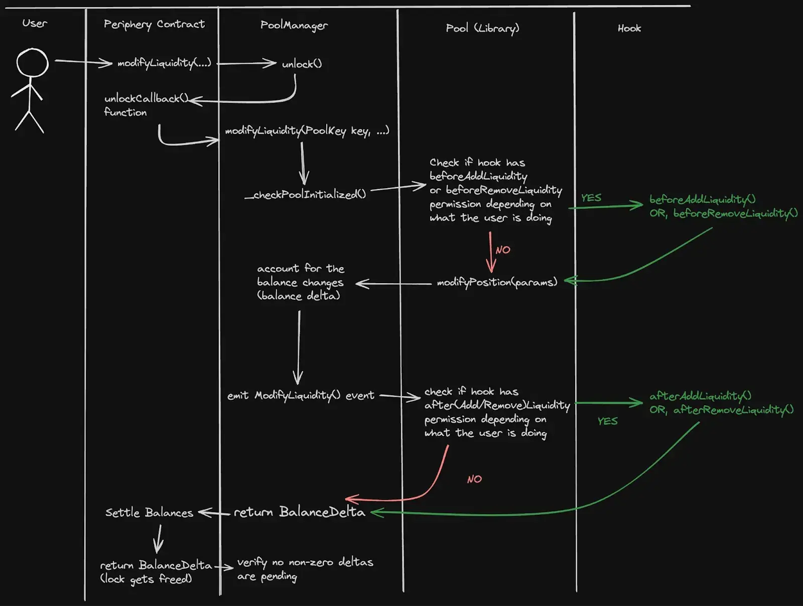
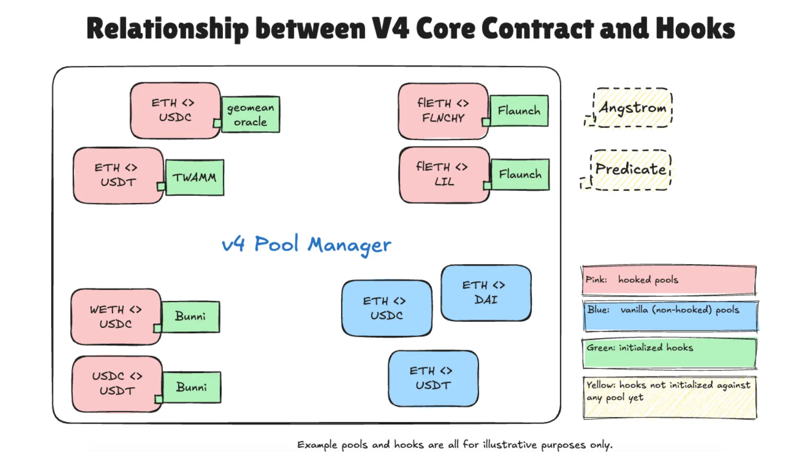

# 🎯 Uniswap V4 Workshop 50-Minute Complete Script

## 📋 Workshop Overview

- **Duration**: 50 minutes
- **Objective**: Experience the complete flow of developing, deploying, testing, and analyzing Uniswap V4 Hooks
- **Focus**: Understanding implementation patterns with security at the center

### 📦 Required Tools

- **Foundry**: For smart contract compilation and deployment
- **TypeScript/Node.js**: For running SDK scripts
- **Docker Desktop**: For running Indexer (PostgreSQL + Hasura) ⚠️ **Must be running**
- **Bun**: Package manager (recommended)
- **pnpm**: Package manager for Indexer and Dashboard (⚠️ Used for apps/ directory)

---

## ⏱️ Timetable

| Time      | Section               | Content                                                           |
| --------- | --------------------- | ----------------------------------------------------------------- |
| 0-5 min   | Environment Setup     | Clone repository, install dependencies, set environment variables |
| 5-17 min  | Hook Deployment       | Deploy with HookMiner, Foundry tests, understand permission bits  |
| 17-25 min | Pool Creation         | Create pool with deployed hook, verify configuration              |
| 25-35 min | SDK Operations        | Add/remove liquidity, execute swaps, verify hook behavior         |
| 35-42 min | Indexer/UI Launch     | Visualization with Envio Indexer and dashboard                    |
| 42-50 min | Security Review & Q&A | Important security patterns, summary                              |

---

## 🎬 Section 1: Environment Setup (0-5 min)

### 1.1 Introduction (1 min)

> Hello everyone. Today we'll be conducting a Uniswap V4 Hooks workshop.
> In 50 minutes, we'll deploy and test V4's innovative Hooks feature.
> We'll particularly focus on security-first implementation patterns.

### 1.2 Repository Setup (2 min)

```bash
# First, clone the workshop repository
git clone https://github.com/ZaK3939/v4-workshop
cd v4-workshop

# Install dependencies using Bun
# Note: Do not use npm or yarn (except for Indexer)
bun install
```

> Please wait while Bun installs the dependencies.
> Meanwhile, let me briefly explain the features of V4 Hooks.

### 1.3 Environment Variables Configuration (2 min)

```bash
# Navigate to contracts directory
cd contracts

# Copy environment variables file
cp .env.example .env
```

> Open the .env file and configure the following:

```env
# Unichain Mainnet RPC endpoint
UNICHAIN_RPC=https://unichain-rpc.publicnode.com

# Your private key (without 0x prefix)
# ⚠️ NEVER commit this to Git!
PK=your_private_key_here

# Etherscan API key (optional)
ETHERSCAN_API_KEY=your_etherscan_api_key
```

> Once you've set your private key, let's check your balance:

```bash
# Load environment variables
source .env

# Set deployer address (important!)
export ETH_FROM=$(cast wallet address --private-key $PK)
echo "Deployer address: $ETH_FROM"

# Check balance
cast balance $ETH_FROM --rpc-url $UNICHAIN_RPC | cast from-wei
```

> Please ensure you have at least 0.0005 ETH balance.

---

## 🎬 Section 2: Hook Deployment (5-17 min)

### 2.1 Understanding V4 Hooks' Uniqueness (3 min)

> The most innovative aspect of V4 Hooks is that **permission information is encoded in the contract address itself**.
> CSMM (a constant sum market maker custom curve hook) contract as an example. If we look at the last 2 bytes of the hook address, 4888, and convert it to 16 bits, we get 01_00100010001000.

```
Example: 0x1EC90889C6633A0d01932fbf83be93c22d194888

decodes hook addresses to find enabled hook flags by extracting the last 2 bytes, converting to binary, and applying a bitwise AND:
```



> The figure above shows the permission bits for a CSMM (Constant Sum Market Maker) Hook.
> Each bit corresponds to a specific callback function, and only bits set to 1 can be executed.
>
> What does this mean?
>
> 1. **Deterministic Address**: HookMiner calculates addresses for specific permissions
> 2. **Gas Efficiency**: PoolManager checks permissions with fast bit operations
> 3. **Security**: Permissions are immutable and cannot be tampered with at runtime

### 2.2 Deploying LiquidityPenaltyHook (5 min)

> Now, let's deploy the LiquidityPenaltyHook.
> This Hook is designed to prevent JIT attacks.

#### What is a JIT Attack?

> **JIT (Just-In-Time) attack** is an exploitative strategy used by MEV bots:


> As shown above, JIT attacks are executed in 3 steps:
>
> 1. **Detect large swap** → MEV bot discovers large transaction in mempool
> 2. **Add liquidity just before** → Provide large liquidity just before the swap
> 3. **Capture fees** → Earn substantial fees from the large swap
> 4. **Remove liquidity immediately** → Withdraw liquidity right after swap completion
>
> This allows capturing fees without bearing long-term risk.
> Check today's JIT activity: https://dexanalytics.org/schemas/jit-liquidity-events

#### LiquidityPenaltyHook Defense Mechanism

> This Hook prevents JIT attacks with the following mechanism:
>
> **Penalty Calculation Formula**:
>
> ```
> penalty = fees × (blockNumberOffset - elapsedBlocks) / blockNumberOffset
> ```
>
> - **Removal within 10 blocks**: Maximum 100% penalty
> - **Linear decay**: Penalty decreases over time
> - **Penalty distribution**: Confiscated fees are donated to existing LPs
>
> This discourages short-term profit seeking and protects long-term LPs.

```bash
# Reconfirm environment variables (important!)
source .env
export ETH_FROM=$(cast wallet address --private-key $PK)
echo "deployer: $ETH_FROM"

# Deploy Hook
forge script script/01_DeployAndSave.s.sol \
    --rpc-url $UNICHAIN_RPC \
    --private-key $PK \
    --broadcast \
    --legacy \
    --ffi \
    -vvv
```

> While the script executes, let me explain what's happening:
>
> 1. **HookMiner calculates permission bits**
>
>    - afterAddLiquidity: ✅
>    - afterRemoveLiquidity: ✅
>    - afterAddLiquidityReturnDelta: ✅
>    - afterRemoveLiquidityReturnDelta: ✅
>
> 2. **Deploy with CREATE2**
>    - Deploy precisely to calculated address
>    - Generate deterministically using salt

### 2.3 Verifying Deployment Results (2 min)

```bash
# Check deployed addresses
cat script/.deployment.env

# Verify contract code
cast code $(cat script/.deployment.env | grep LIQUIDITY_PENALTY_HOOK | cut -d'=' -f2) --rpc-url $UNICHAIN_RPC | wc -c
```

> If code size is greater than 0, deployment was successful!

### 2.4 Running Foundry Tests (2 min)

> Before deployment, let's verify the Hook's behavior with tests:

```bash
# Run tests with Unichain fork
cd contracts
forge test --fork-url $UNICHAIN_RPC -vvv
```

> **Foundry Test Features**:
>
> - **Unichain Fork**: Perfectly reproduce production environment state
> - **Actual PoolManager**: Use deployed V4 contracts
> - **Hook Behavior Verification**: Accuracy of penalty calculations and fee distribution
> - **Gas Consumption Measurement**: Pre-check actual gas costs
>
> This allows complete verification before production deployment.

---

## 🎬 Section 3: Pool Creation (17-25 min)

### 3.1 Preparing for Pool Creation (2 min)

> Next, we'll create a pool using the deployed Hook.
> In V4, all pools are managed by a single PoolManager.


> As shown above, in V4:
>
> - All pools managed by single PoolManager
> - Users interact through frontends or smart contracts
> - All swaps/liquidity operations go through PoolManager

### 3.2 Executing Pool Creation Script (5 min)

```bash
# Create ETH/USDC pool (0.3% fee)
forge script script/02_CreatePool.s.sol \
    --rpc-url $UNICHAIN_RPC \
    --private-key $PK \
    --broadcast \
    --legacy \
    -vvv
```

> While the pool is being created, let me explain V4's pool structure:

#### Initial Price Setting Using V3 Pool

> V4 pool initialization **retrieves the current price from existing V3 pools**:
>
> ```solidity
> // Get price from V3 ETH/USDC 0.3% pool
> (uint160 sqrtPriceX96,,,,,,) = IUniswapV3Pool(v3Pool).slot0();
> ```
>
> **Why reference V3 pools?**
>
> - **Price consistency**: V3 has abundant liquidity reflecting accurate market prices
> - **Reduced arbitrage opportunities**: Minimize price differences between V3/V4
> - **Smooth transition**: Existing V3 users can use V4 seamlessly
>
> This allows V4 pools to start with proper market prices from the beginning.

> **PoolKey Structure**:
>
> - `currency0`: ETH (address 0)
> - `currency1`: USDC
> - `fee`: 3000 (0.3%)
> - `tickSpacing`: 60
> - `hooks`: Deployed Hook address

### 3.3 Displaying Pool Information (3 min)

```bash
# Verify pool information
forge script script/03_ShowPoolInfo.s.sol \
    --rpc-url $UNICHAIN_RPC \
    -vvv
```

> Please check the displayed information:
>
> 1. **Hook Permissions**: List of enabled permissions
> 2. **Pool ID**: Generated from keccak256(PoolKey)
> 3. **Current Price**: Initial price (no liquidity yet)

---

## 🎬 Section 4: SDK Operations (25-35 min)

### 4.1 Checking Pool State (2 min)

```bash
# Return to project root
cd ..

# Check current pool state
bun run scripts/check-pool-state.ts
```

> Please confirm that liquidity is still 0.

### 4.2 Adding Liquidity (3 min)

> In V4, liquidity is managed as Position NFTs.

#### Liquidity Addition Flow



> The figure above shows the detailed flow when adding liquidity:
>
> 1. User calls modifyLiquidity through Periphery Contract
> 2. PoolManager executes unlock and calls callback function
> 3. Checks Hook permissions and executes relevant before/after hooks
> 4. Calculates BalanceDelta and executes token settlement

#### Liquidity Amount Calculation

> The required amounts when adding liquidity are determined by the following formula:
>
> 
>
> **Example (ETH/USDC, 1 ETH = 3990 USDC)**:
>
> - **Current price**: √3990 ≈ 63.17 (sqrtPriceX96 format)
> - **Range**: 3000-5000 USDC/ETH
> - **When adding 0.1 ETH**: Approximately 399 USDC required
>
> This calculation automatically determines the ratio of both currencies.

```bash
# Add ETH and USDC
bun run scripts/04-add-liquidity.ts
```

> During script execution, note the following points:

#### Key Code Section:

```typescript
// Create position using V4 SDK
const position = Position.fromAmount0({
  pool,
  tickLower,
  tickUpper,
  amount0: desiredEthAmount.toString(),
  useFullPrecision: true,
});

// MintOptions configuration
const mintOptions: MintOptions = {
  recipient: account.address,
  slippageTolerance: new Percent(50, 10_000), // 0.5%
  deadline: deadline.toString(),
  useNative: ETH, // Use ETH as native token
  hookData: '0x',
};

// Create position with V4PositionManager
const v4PositionManager = new V4PositionManager();
const actions = v4PositionManager.addLiquidity(position, mintOptions);
```

> 1. **Position.fromAmount0**: Automatically calculate required USDC from ETH amount
> 2. **useNative**: Use ETH directly without wrapping to WETH
> 3. **V4PositionManager**: V4-specific position management
> 4. **Permit2**: Gasless approval for USDC

### 4.3 Immediate Liquidity Removal (Penalty Test) (3 min)

> Let's verify LiquidityPenaltyHook's behavior:

```bash
# Remove liquidity immediately
bun run scripts/06-remove-liquidity.ts
```

#### Key Code Section:

```typescript
// Calculate liquidity to remove (50% removal)
const percentageToRemove = 0.5;
const liquidityToRemove = (currentLiquidity * BigInt(50)) / BigInt(100);

// BurnOptions configuration
const burnOptions: BurnOptions = {
  tokenId: BigInt(tokenId),
  liquidityPercentage: new Percent(50, 100),
  slippageTolerance: new Percent(10, 10_000), // 0.1%
  deadline: deadline.toString(),
  collectOptions: {
    expectedCurrencyOwed0: CurrencyAmount.fromRawAmount(ETH, 0),
    expectedCurrencyOwed1: CurrencyAmount.fromRawAmount(USDC, 0),
    recipient: account.address,
  },
};

// Remove liquidity with V4PositionManager
const v4PositionManager = new V4PositionManager();
const { actions } = v4PositionManager.removeLiquidity(position, burnOptions);
```

> ⚠️ **Penalty will be applied!**
>
> - Only 2 blocks have passed since addition
> - Penalty rate: 80%
> - 80% of fees will be donated to the pool
>
> 1. **liquidityPercentage**: Percentage of liquidity to remove
> 2. **collectOptions**: Fee collection settings
> 3. **LiquidityPenaltyHook**: Confiscates portion of fees

### 4.4 Executing Swap (2 min)

```bash
# Swap 0.01 ETH to USDC
bun run scripts/05-swap-universal-router.ts
```

> Note the execution through Universal Router.

#### Key Code Section:

```typescript
// Build swap action with V4Planner
const v4Planner = new V4Planner();
const routePlanner = new RoutePlanner();

// Swap parameters
const swapParams = {
  poolKey: swapConfig.poolKey,
  zeroForOne: true, // ETH → USDC
  amountIn: swapAmount.toString(),
  amountOutMinimum: minAmountOut.toString(),
  hookData: '0x' as `0x${string}`,
};

// Add V4 actions
v4Planner.addAction(Actions.SWAP_EXACT_IN_SINGLE, [swapParams]);
v4Planner.addAction(Actions.SETTLE_ALL, [ETH, MAX_UINT128]);
v4Planner.addAction(Actions.TAKE_ALL, [USDC, 0n]);

// Add V4 command to Universal Router
routePlanner.addCommand(CommandType.V4_SWAP, [v4Planner.actions.toString()]);
```

> 1. **V4Planner**: Build V4-specific actions
> 2. **SETTLE_ALL**: Send ETH to PoolManager
> 3. **TAKE_ALL**: Receive USDC
> 4. **Universal Router**: Execute with V4_SWAP command

#### Swap Execution Flow


> The figure above shows the detailed flow during swap execution:
>
> 1. User calls swap through Periphery Contract
> 2. PoolManager checks beforeSwap permission
> 3. Execute swap and calculate BalanceDelta
> 4. Check afterSwap permission and execute if needed
> 5. Final token settlement (transfer/ERC-6909)

#### What is Universal Router?

> **Universal Router** is Uniswap's unified routing contract:
>
> - **Multi-protocol support**: Handle V2, V3, V4 with single entry point
> - **Batch execution**: Execute multiple operations in one transaction
> - **Permit2 integration**: Support gasless token approvals
> - **Optimal route selection**: Automatically select best price from multiple pools
>
> In V4, all swaps are executed through Universal Router,
> never calling PoolManager directly.

---

## 🎬 Section 5: Indexer/UI Launch (35-42 min)

### 5.1 Introduction to Envio Indexer and Docker Check (3 min)

#### What is Envio HyperIndex?


> **Envio HyperIndex** is a high-speed blockchain data indexing solution:
>
> - **Real-time event tracking**: Stream events with minimal latency
> - **Ultra-fast backfill**: 100x faster than competitors (15x faster than Subsquid, 143x faster than theGraph)
> - **Multi-chain support**: Query multiple chains with single API
> - **Automatic reorg handling**: Zero-downtime reorg processing
>
> In this workshop, we'll track and analyze all V4 pool activities.

> ⚠️ **Important: Docker Desktop must be running**
>
> Indexer runs PostgreSQL and Hasura in Docker containers,
> so please start Docker Desktop beforehand.

```bash
# Verify Docker Desktop is running
docker ps

# If successful, you'll see container list output like:
# CONTAINER ID   IMAGE     COMMAND   CREATED   STATUS    PORTS     NAMES

# If error occurs, start Docker Desktop

# Launch Indexer (PostgreSQL + Hasura auto-start)
bun run indexer
```


> As shown above, when Indexer starts:
>
> - **Large ENVIO logo** appears and indexing begins
> - **Processed events**: 22,451,830 events processed at high speed
> - **Processed blocks**: 25,013,372 blocks (90% progress)
> - **Real-time progress**: Shows sync status with percentage bar
>
> Indexer tracks the following events:
>
> - **Initialize**: Pool creation events
> - **Swap**: All transaction information (amounts, sender, block number)
> - **ModifyLiquidity**: Liquidity additions/removals
> - **Transfer/Approval**: Position NFT movements

### 5.2 Checking Data with GraphQL (2 min)

> Envio provides GraphQL endpoints for easy complex queries:

```bash
# Search for latest swaps
curl -s http://localhost:8080/v1/graphql \
  -X POST \
  -H "Content-Type: application/json" \
  -d '{
    "query": "{ Swap(order_by: {blockNumber: desc}, limit: 5) { id amount0 amount1 sender blockNumber } }"
  }' | jq
```

> Access http://localhost:8080/console in your browser
> to create queries visually with Hasura GraphQL Explorer.

### 5.3 Launching Dashboard UI (2 min)

> To visually check V4 activity, let's launch the dashboard:

> ⚠️ **Note: Dashboard uses Indexer data**
>
> Please ensure Indexer (Docker containers) is running properly before executing.

```bash
# Run from project root
bun run dashboard
```

> Once the dashboard starts, access http://localhost:3000 in your browser.


> **What you can see on the dashboard**:
>
> - **Hooked Pulse**: Real-time activity of pools with hooks
> - **Hook Swaps**: Latest swap transactions (time, pair, amount)
> - **Hook Liquidity**: Liquidity add/remove events
> - **Dynamic Hooks**: Advanced hook activities like dynamic fees
> - **Auto-refresh**: Displays latest data every second
>
> As shown above, you can see activities for each Hook address at a glance,
> allowing real-time monitoring of your deployed LiquidityPenaltyHook's behavior.

---

## 🎬 Section 6: Security Review and Summary (42-50 min)

### 6.1 Important Security Patterns (5 min)

> Let me introduce the 3 most important security patterns for V4 Hooks:

#### 1. **onlyPoolManager Modifier** (Most Important)

```solidity
modifier onlyPoolManager() {
    if (msg.sender != address(poolManager)) {
        revert OnlyPoolManager();
    }
    _;
}
```

> Required for all Hook callbacks.
> Without this, anyone could call the Hook.

#### 2. **State Isolation Between Pools**

```solidity
mapping(PoolId => mapping(address => uint256)) private _lastAddedLiquidityBlock;
```

> Prevents state mixing when used by multiple pools.

#### 3. **Zero Checks**

```solidity
if (liquidity == 0) revert NoLiquidityToReceiveDonation();
```

> Prevents division by zero errors and DoS attacks.

### 6.2 How LiquidityPenaltyHook Works (3 min)

> Let's look closely at the JIT attack prevention mechanism:

```solidity
// Penalty calculation formula
penalty = fees * (1 - elapsedBlocks / blockNumberOffset)
```

> - Linear decay: 100%→0% over 10 blocks
> - Penalties donated to in-pool LPs
> - Protects long-term LPs, discourages short-term profit seeking

### 6.3 Workshop Summary (2 min)

> What we learned today:



> The figure above shows the full picture of V4:
>
> - Central PoolManager manages multiple pools
> - Each pool has different Hooks (green, pink, yellow)
> - External protocols like Angstrom and Predicate can also integrate
>
> ✅ **Special Deployment with HookMiner**
>
> - How permissions are encoded in addresses
> - Deterministic deployment with CREATE2
>
> ✅ **Security Patterns**
>
> - Importance of onlyPoolManager modifier
> - State isolation between pools
> - Proper error handling
>
> ✅ **V4 SDK Utilization**
>
> - Gasless approvals with Permit2
> - Batch execution with V4Planner
> - Liquidity management with Position NFTs
>
> ✅ **Practical Development Flow**
>
> - Smart contract development with Foundry
> - Integration with TypeScript SDK
> - Analysis with Envio Indexer

---

## 💡 Additional Resources

### Documentation

- [Uniswap V4 Documentation](https://docs.uniswap.org/contracts/v4/overview)
- [OpenZeppelin Hooks Audit Report](https://blog.openzeppelin.com/openzeppelin-uniswap-hooks-v1.1.0-rc-1-audit)

### Community

- [Japanese Community](https://t.me/uniswapjp)
- [Uniswap V4 Dojo](https://t.me/c/1793969856/1)

### Grants

- Unichain Hook Grant (hosted by UF & Atrium)
- Funding for innovative Hook implementations

---

## Q&A (Remaining Time)

> Do you have any questions?
> Questions about Hook ideas or security are welcome.

### Common Questions:

**Q: Why is HookMiner needed?**

> A: In V4, permissions are encoded in addresses, so we need to find addresses with specific bit patterns.

**Q: Can multiple Hooks be combined?**

> A: No, only one Hook per pool. However, a Hook can call other contracts.

**Q: What about gas costs?**

> A: Depends on Hook complexity, but simple Hooks typically add 5-20% overhead to normal transactions.

---

## 🧹 Cleanup (After Workshop)

### Post-Workshop Cleanup

> Great job completing the workshop! Let's clean up the environment.

#### 1. Remove Liquidity

```bash
# Remove the liquidity you provided
bun run scripts/06-remove-liquidity.ts
```

#### 2. Stop Docker Containers

```bash
# After stopping the Indexer with Ctrl+C, stop Docker containers
docker stop $(docker ps -q)

# Quit Docker Desktop
# macOS: Quit Docker Desktop from menu bar
# Windows: Exit Docker Desktop from system tray
```

#### 3. Stop Processes

```bash
# Stop running processes like Dashboard
# Stop with Ctrl+C, or from another terminal:
lsof -i :3000  # Check Dashboard PID
kill -9 <PID>
```

> ⚠️ **Note**: Since we're using mainnet (Unichain Mainnet), deployed contracts remain permanently on-chain.

---

## 🎉 Workshop Complete

> Great job everyone!
> Welcome to the world of Uniswap V4 Hooks.
> Use what you learned today to build innovative DeFi protocols!

### Next Steps:

1. Try other Hook implementations (AntiSandwichHook, LimitOrderHook)
2. Implement your own Hook ideas
3. Apply for Unichain Hook Grant

**Building the Future of DeFi with Uniswap V4! 🚀**
